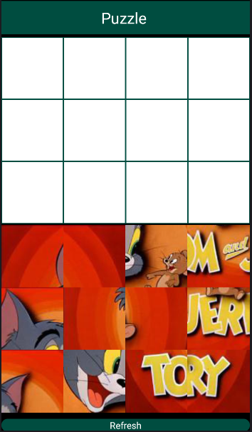

# Puzzle Game

## React-Native App

:pizza: Puzzle Game using React Native for Mobile App :pizza: 

This project is a fun mobile puzzle game developed using React Native. Players solve puzzles by arranging Tom and Jerry themed images in the correct order.

🚀 Features
  - 🐭 Tom & Jerry themed puzzle images
  - 🧠 Multiple difficulty levels
  - 📱 Mobile friendly (iOS & Android)
  - ⚡ Smooth and responsive gameplay
🛠️ Technologies Used
  - React Native
  - JavaScript

📦 Installation
To run the project:

```
git clone https://github.com/BalamiRR/Puzzle-Game.git
cd tom-jerry-puzzle
npm install
npx react-native run-android
# or
npx react-native run-ios
```




🎮 How to Play
- Drag and place puzzle pieces into the correct positions
- Complete the puzzle to finish the level
- Progress to more challenging levels

📌 Notes

This project was created for educational and entertainment purposes.
